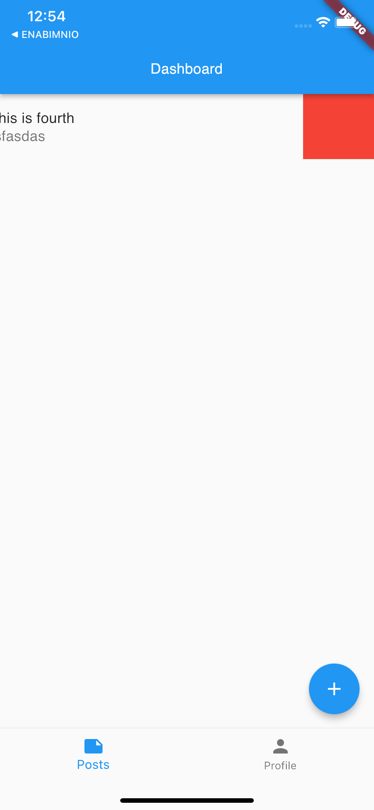

# Flutter demo with Riverpod

## Project
In this project we can login/register with the dummy api.
In Dashboard page there is a bottom navigation bar,
i. First is responsible for displaying and performing CRUD operation with products that is stored in local database that is Sqflite
ii. In second tab, the profile information of the logged in user is displayed.

### In First tab
<b>Create </b>: To create new product click on + icon which is at the bottom-right corner of the screen. 
Fill the form with title and description.

<b> Update</b>: To update the product, simply click on the product and the form appears and you can update the records.

<b>Delete </b>: To delete records, Swipe the item from right to left.
